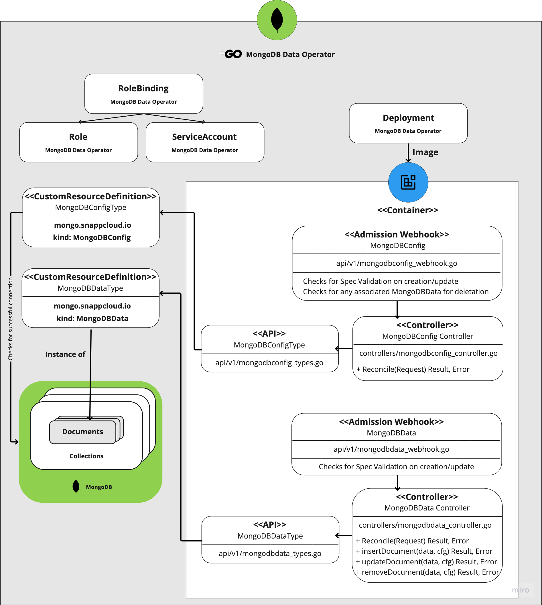

[](https://github.com/mrjosh/mongodb-data-operator/pkgs/container/mongodb-data-operator-dev)
[](https://github.com/mrjosh/mongodb-data-operator/raw/develop/bundle.yaml)


# MongoDB Data Operator
The MongoDB Data Operator aims to manage the full lifecycle of a mongodb document in you Kubernetes container platforms.



## Overview
The MongoDB Data Operator provides Kubernetes management of MongoDB data store and related mongodb queries.
The purpose of this project is to simplify the mongodb queries for Kubernetes clusters.
A core feature of the MongoDB Data Operator is to create, update, delete mongodb documents

The MongoDB Data operator includes the following features:

* **Kubernetes Custom Resources**: Use Kubernetes custom resources to create, update, delete datas in mongodb collections

## CustomResourceDefinitions
The Operator acts on the following [custom resource definitions (CRDs)](https://kubernetes.io/docs/tasks/access-kubernetes-api/extend-api-custom-resource-definitions/):

* **`MongoDBConfig`**, which defines a desired MongoDB database connection and collection

* **`MongoDBData`**, which defines a desired MongoDB document

## Getting Started
* You’ll need a Kubernetes cluster to run against. You can use [KIND](https://sigs.k8s.io/kind) to get a local cluster for testing,
simply, run `make kind` to have a kind cluster inside your docker.

* or run against a remote cluster.

### Prometheus Installation

You may also need Prometheus installed on your cluster for monitoring,
simply use the below command for prometheus installation on your cluster
```sh
kubectl apply -f https://raw.githubusercontent.com/coreos/prometheus-operator/release-0.33/bundle.yaml
```

### Installation
To quickly try out just the MongoDB data Operator inside a cluster, run the following command:
```sh
kubectl create -f https://github.com/mrjosh/mongodb-data-operator/raw/develop/bundle.yaml
```

### Removal
To remove the MongoDB data Operator, simply run:
```sh
kubectl delete -f https://github.com/mrjosh/mongodb-data-operator/raw/develop/bundle.yaml
```

## Examples
Define your mongodb connection inside a MongoDBConfig cluster-scoped resource
```sh
cat <<EOF | kubectl create -f -
  apiVersion: mongo.snappcloud.io/v1
  kind: MongoDBConfig
  metadata:
    name: mongo1
  spec:
    mongourl: mongodb://127.0.0.1:27017
    collection: mongo1
EOF
```

Define your mongodb document inside a MongoDBData namespace-scoped resource
```sh
cat <<EOF | kubectl create -f -
  apiVersion: mongo.snappcloud.io/v1
  kind: MongoDBData
  metadata:
    name: example
    namespace: sth
  spec:
    db: mongo1
    data:
      firstname: mohammad
      lastname: yosefpor
      email: myusefpur@gmail.com
      age: 70
EOF
```

## MongoDB docker-compose
You can quickly run a mongodb database inside docker container
```sh
docker compose -f mongodb-docker-compose.yaml up -d
```

## Contributing
Thank you for considering contributing to MongoDB data operator project!

### How it works
This project aims to follow the Kubernetes [Operator pattern](https://kubernetes.io/docs/concepts/extend-kubernetes/operator/)

It uses [Controllers](https://kubernetes.io/docs/concepts/architecture/controller/) 
which provides a reconcile function responsible for synchronizing resources untile the desired state is reached on the cluster 

## License

Copyright 2022.

Licensed under the Apache License, Version 2.0 (the "License");
you may not use this file except in compliance with the License.
You may obtain a copy of the License at

    http://www.apache.org/licenses/LICENSE-2.0

Unless required by applicable law or agreed to in writing, software
distributed under the License is distributed on an "AS IS" BASIS,
WITHOUT WARRANTIES OR CONDITIONS OF ANY KIND, either express or implied.
See the License for the specific language governing permissions and
limitations under the License.

